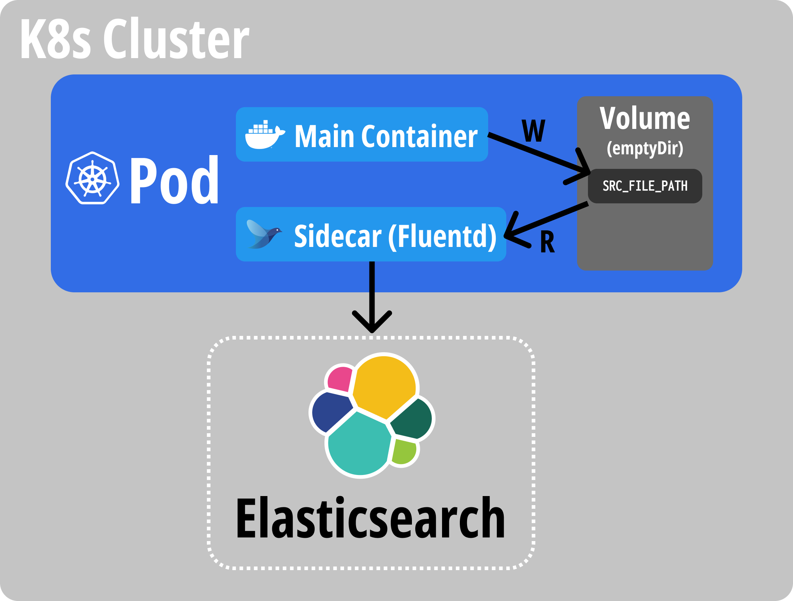

# Fluentd sidecar image for Elasticsearch

## Purpose of the image

The purpose of this image is to read the file (like log file) and send the data to the Elasticsearch.

This is brief scenario of the intended workflow:

1. The main container writes some data to the `SRC_FILE_PATH`
2. The sidecar container watches the `SRC_FILE_PATH` and sends the data to the Elasticsearch
3. Elasticsearch indexes the data with the index provided from fluentd, which is `fluentd.${SRC_TAG}.${YYYYMMDD}`

## Environment variables

1. `FLUENTD_VER`: Version of the Fluentd image. Default is `v1.14-1`
2. `ES_CLIENT_VER`: Version of the Elasticsearch client package. Default is `7.17.1`
3. `ES_HOST_URL`: URL of the Elasticsearch. No defaults.
4. `ES_HOST_PORT`: Port of the Elasticsearch. Default is `9200`
5. `SRC_FORMAT`: Format of the source data. Default is `none`
6. `SRC_FILE_PATH`: Path of the source file. No defaults.
7. `SRC_TAG`: Fluentd tag of the souce data. Defaults is `mypod`.
